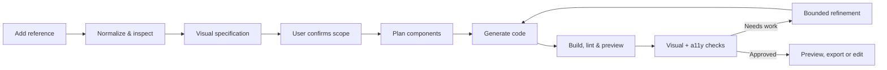
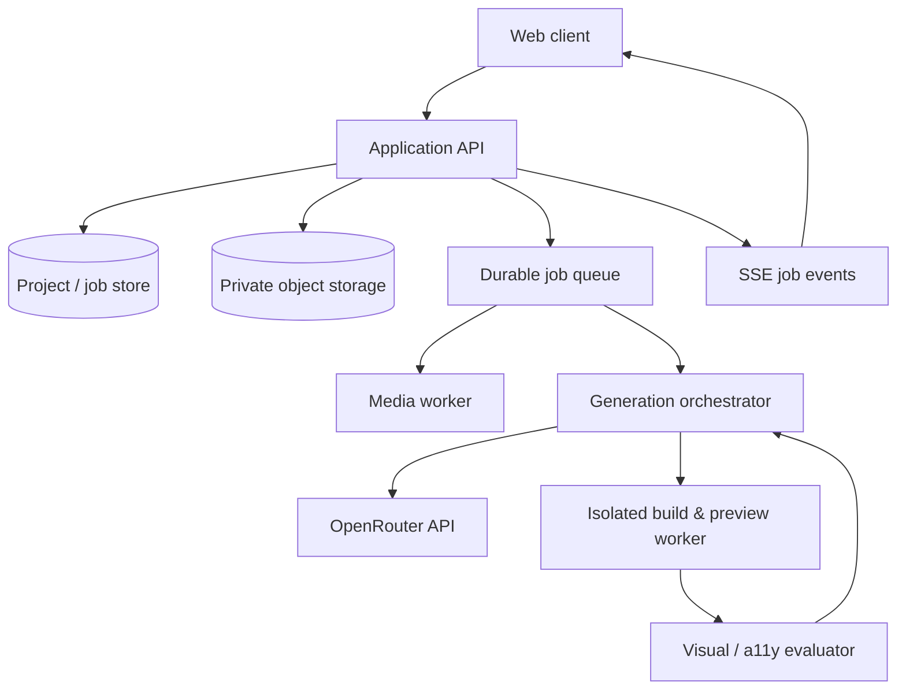

# Screenshot-to-Code Studio

> Also suitable for a product branded **PixelForge AI**: a reference-to-frontend studio that turns supplied UI evidence into an editable, validated frontend project.

Turn a website screenshot, a short interface video, a design file, or pasted visual reference into clean, runnable frontend code. Screenshot-to-Code is designed for **visual fidelity first**: it reconstructs the supplied interface closely, then improves only the interaction, accessibility, responsiveness, and implementation quality that can be safely inferred from the reference.

The product uses **OpenRouter exclusively** for AI access. It is built to work on OpenRouter’s free-model pool—using a selected free model where available, with `openrouter/free` as a capability-aware fallback. No direct Anthropic, OpenAI, or other model-provider key is required or accepted.

> A reference is the source of truth. Do not invent unrelated sections, branding, copy, or product features. When a detail cannot be seen, use a restrained, reusable default and record the assumption.

## What the product delivers

- Upload or drop a screenshot, a video, a ZIP of assets, or a supported design export.
- Paste an image from the clipboard, paste an image URL, or paste a page URL for a user-authorized reference capture.
- Extract representative frames from video and let the user choose the frame or compare multiple states.
- Generate a complete responsive interface: React + TypeScript + Tailwind CSS by default, with a deliberate component tree and local placeholder assets where originals are unavailable.
- Validate the generated project, render it in an isolated preview, compare it with the reference, and make bounded refinement passes.
- Show a visual-diff score, generated files, assumptions, accessibility findings, and every generation/refinement event.
- Export a clean project, copy an individual file, or continue refining with plain-language instructions.

## Product principles

1. **Reference-led, not imagination-led.** Reproduce hierarchy, spacing, typography, palette, components, and visible states from the supplied material.
2. **Improve without redesigning.** Add keyboard access, focus states, responsive behavior, semantic markup, and motion safety—but do not add new content blocks or alter the visual direction.
3. **Evidence before generation.** Analyse the image/video and present a compact plan before expensive code generation.
4. **Validate before showing success.** A result is not complete until it compiles, renders, passes basic accessibility checks, and has been visually compared.
5. **Keep users in control.** Make the selected reference frame, model, framework, assumptions, generated code, and retry/refinement history visible and editable.
6. **Protect data by default.** Keep keys server-side, use short-lived uploads, strip metadata where practical, and never train on or republish user inputs.

## End-to-end workflow



### 1. Add a reference

The landing composer has a single obvious primary action: **Drop a reference to begin**. The entire canvas accepts drag-and-drop. It also contains compact secondary controls for file selection and paste.

Supported inputs:

| Input | Handling | User decision |
| --- | --- | --- |
| PNG, JPG, WebP, AVIF | Preserve dimensions, create an optimized analysis copy and a preview | Crop / choose viewport if needed |
| MP4, WebM, MOV | Inspect duration; extract a contact sheet and key frames | Pick one frame, or designate desktop/mobile states |
| GIF | Decode representative frames | Pick a frame/state |
| PDF/design export | Render pages/artboards to images; retain source as attachment | Pick target page/artboard |
| ZIP/assets | Scan safely, list usable images/fonts/SVGs; never execute contents | Map supplied assets to visual elements |
| Clipboard image | Read only after an explicit paste action | Use, replace, or clear |
| Image URL | Fetch through a server-side allowlisted downloader | Confirm fetched preview |

Reject unsupported files early, explain why in plain language, and never silently convert or discard the original. The API enforces configurable size, duration, page, archive-entry, and decompressed-size limits.

### Reference sets, video states, and scope

A project can contain a **reference set**, not only one image. Users may label supplied material as Desktop, Tablet, Mobile, Scrolled, Menu open, Modal open, Hover, or Optional asset. The analyser must treat these as related breakpoints or states of one experience, never as a prompt to merge unrelated pages.

For video, extract the opening and closing frame, scene-change frames, and evenly sampled frames; remove perceptual duplicates and cap the payload. Let the user designate a single source frame, or a compact set of responsive/interactive evidence. If the chosen model cannot inspect video directly, only selected extracted frames are used.

Text requirements are allowed as an explicit **brief** beside the reference. They may clarify framework, target viewport, or a requested improvement; they never override the visual reference or change scope silently.

### 2. Inspect and confirm

The app produces a **Visual Spec** instead of immediately generating code. It identifies:

- page purpose and viewport class;
- visible sections, layout grid, spacing rhythm, and content hierarchy;
- palette, typography traits, radii, elevation, borders, and imagery;
- interactions that are actually visible or strongly implied;
- responsive evidence from multiple supplied frames;
- unclear details and conservative assumptions.

Show the spec alongside the selected reference. The user can correct it, mark regions as “match exactly”, remove a region from scope, choose a framework, and choose a model. Generation starts only after confirmation, except when “Generate now” is explicitly selected.

### 3. Generate, validate, and refine

Generation proceeds as a traceable job. The UI streams status without exposing hidden reasoning:

1. construct a component and asset plan;
2. generate an initial project from a strict file contract;
3. parse returned files and block unsafe/path-traversal output;
4. format, type-check, lint, and build in an isolated worker;
5. run the preview and capture the target viewport;
6. compare the capture to the reference and run lightweight accessibility checks;
7. send only focused diff findings to a repair prompt;
8. stop after the configured refinement budget, or earlier when quality thresholds are met.

If a check fails, the user sees the failing phase, the relevant concise error, and retry options. The previous working revision always remains available.

## Interface design system

The application should feel like a focused creative tool: dark ink-blue background, translucent surfaces, restrained color, and generous breathing room. Glassmorphism is used as depth—not as decoration that weakens readability.

### Layout

- **Top bar:** product mark, project name/status, undo/redo, model selector, and export menu.
- **Workspace:** three resizable panels on desktop: Reference, Build activity, and Live preview/code. On smaller screens, panels become a labelled, persistent tab bar.
- **Reference panel:** original asset, frame timeline for video, overlay/diff toggle, annotations, and visual spec.
- **Build panel:** stepper, streaming event log, assumptions, score card, and a single contextual primary action.
- **Preview panel:** device presets, zoom, compare slider, inspect mode, code/file tabs, and copy/download actions.
- **Bottom command bar:** prompt refinement field, attach/add reference control, and “Refine” action. `⌘/Ctrl + K` focuses it.

### Interaction language

- Use 14–18px corner radii, 44px minimum touch targets, and clear labels in addition to icons.
- Primary buttons use a rounded filled gradient with a 150–200ms lift/glow hover; pressed states reduce elevation instead of merely changing color.
- Secondary buttons are translucent with a subtle border; destructive actions are never the default focus.
- Glass panels use `backdrop-filter: blur(18px) saturate(140%)`, a low-alpha fill, a 1px translucent border, and a solid fallback when blur/transparency is unavailable.
- Motion is purposeful: file cards settle into place, panel changes crossfade/slide 160–240ms, and long tasks use determinate phase progress. Respect `prefers-reduced-motion` by removing nonessential movement.
- Focus rings remain high-contrast. Tooltips appear after intent, never replace labels, and never obscure the target.

### Drag, drop, paste, and keyboard support

- A full-window drop overlay appears only while a supported payload is over the app. It names accepted formats and highlights the active target.
- Dropped items become reviewable cards; a multi-file drop asks the user to select the primary reference and optional assets.
- Paste works in the composer and via a visible “Paste image” control. Plain text is treated as a refinement instruction, not as a file.
- Keyboard: `Ctrl/Cmd+V` paste, `Enter` generate/refine, `Esc` close transient surfaces, `[`/`]` switch panels, and `?` opens shortcuts.
- All drop-zone operations have a file-picker equivalent; all state changes are announced through an accessible live region.

### Product screens and states

| Surface | Purpose | Essential controls |
| --- | --- | --- |
| Create | Begin a project with a clear reference-first composer | Drop, choose, paste, URL, target framework, generate |
| Studio | Inspect source, run jobs, compare output, and refine | Reference timeline, stepper, preview toolbar, inspector, command bar |
| History | Reopen safe, immutable work | Reference thumbnail, model route, status, timestamp, export state |
| Settings | Control policy without exposing secrets | OpenRouter key status, free-only policy, preferred families, budgets, retention |

The upload surface exposes `idle`, `drag-over-valid`, `drag-over-invalid`, `uploading`, `processing`, `ready`, and `error` states. The workflow stepper uses `pending`, `active`, `success`, `warning`, `failed`, or `skipped` and explains each outcome in plain language.

## Technical architecture



### Recommended stack

| Layer | Recommendation | Responsibility |
| --- | --- | --- |
| Client | Next.js/React, TypeScript, Tailwind, Framer Motion | Composer, workspace, previews, accessible controls |
| API | Next.js route handlers or Fastify, TypeScript, Zod | Auth, upload initiation, job orchestration, SSE |
| Durable data | Postgres + Prisma/Drizzle | Projects, jobs, revisions, audit metadata |
| Object storage | S3-compatible private bucket | Original files, normalized images, frames, previews, exports |
| Queue | BullMQ/Redis, Cloud Tasks, or equivalent | Retries, back-pressure, cancellation, idempotency |
| Media | Sharp + FFmpeg in worker image | Image normalization, thumbnails, video frame extraction |
| Build sandbox | Ephemeral container or locked-down worker | Install-free build, lint, render, screenshot |
| Comparison | Pixel diff + layout heuristics + model review | Evidence-led visual gap report |
| Observability | Structured logs, traces, error reporting | Job traceability without secrets or source leakage |

Keep the browser untrusted: it never receives `OPENROUTER_API_KEY`, never chooses raw worker commands, and never writes arbitrary project paths. AI calls, media parsing, rendering, and export construction occur behind the API boundary.

### Core services

**Ingestion service**

- Creates signed upload URLs and validates content type, magic bytes, size, and ownership after upload.
- Normalizes images to a predictable color space and records original/analysis dimensions.
- Extracts video frames at scene changes plus a regular interval; produces a labelled contact sheet.
- Scans archives with strict entry count, extension, path, and decompressed-size caps. Reject symlinks and executable files.
- Creates a content hash to deduplicate within the user’s workspace without exposing one user’s files to another.

**Visual-analysis service**

- Sends the selected reference plus dimensions and user intent to a vision-capable OpenRouter model.
- Requires a machine-readable `VisualSpec` JSON result, validated with Zod before persisting.
- Separates observed facts from assumptions, so an uncertain inference cannot become an unmarked requirement.

**Generation orchestrator**

- Selects a model from the live OpenRouter catalog based on `input_modalities`, context size, structured-output support, and free-price eligibility.
- Produces a plan before code. It prompts in stages: visual spec → file plan → code → repair patches.
- Uses a per-job token/time/retry budget, idempotency keys, cancellation checks, and exponential backoff for transient provider errors.
- Saves every immutable revision, prompt version, selected model ID, timing, build result, and evaluation summary.

**Validation/evaluation service**

- Applies schema validation, file-count and output-size limits, dependency allowlists, and static checks before build.
- Builds without network egress and renders at the exact reference viewport.
- Reports only actionable visual gaps: alignment, spacing, sizing, color, typography, imagery, missing visible state, overflow, and contrast.
- Never tells the repair model to add an unobserved feature merely to improve a score.

## OpenRouter-only model access

### Configuration

```bash
OPENROUTER_API_KEY=sk-or-v1-...
OPENROUTER_BASE_URL=https://openrouter.ai/api/v1
OPENROUTER_HTTP_REFERER=https://your-app.example
OPENROUTER_APP_TITLE=Screenshot-to-Code
```

Use `POST /chat/completions` through `https://openrouter.ai/api/v1`. Server requests send `Authorization: Bearer …`; `HTTP-Referer` and `X-Title` are optional attribution headers. See the official [OpenRouter quickstart](https://openrouter.ai/docs/quickstart).

### Model policy

Model availability and free status change, so do not hard-code a model as permanently free. Refresh `GET /models` periodically and retain only models that meet the job’s capabilities and current zero-price policy. The documented `openrouter/free` router automatically selects an available free model compatible with request capabilities; a specific free variant uses the `:free` suffix. See [Free Models Router](https://openrouter.ai/docs/guides/routing/routers/free-router) and [model variants](https://openrouter.ai/docs/guides/routing/model-variants/free).

Use these user-facing lanes:

| Lane | Selection strategy | Use |
| --- | --- | --- |
| Balanced free | `openrouter/free` | Default; lets OpenRouter select a capable free model |
| Pinned free | A live catalog model with `:free` | Reproducible runs after capability verification |
| Vision-first free | Free model advertising image input | Screenshot/video-frame analysis |
| Code-first free | Free model with strong code/structured-output support | File generation and repair |
| User selected | Any current OpenRouter model explicitly chosen by the user | Advanced override, with cost state shown |

Nemotron, Gemma, Llama, Qwen, and other free-capable families can be offered only when the live catalog says the selected variant supports the requested modality and is free. The model selector must display the exact model ID, capability badges, current cost state, and a warning that free availability/rate limits may change.

```ts
const response = await fetch(`${process.env.OPENROUTER_BASE_URL}/chat/completions`, {
  method: "POST",
  headers: {
    "Content-Type": "application/json",
    Authorization: `Bearer ${process.env.OPENROUTER_API_KEY}`,
    "HTTP-Referer": process.env.OPENROUTER_HTTP_REFERER ?? "",
    "X-Title": process.env.OPENROUTER_APP_TITLE ?? "Screenshot-to-Code",
  },
  body: JSON.stringify({
    model: selectedModelId ?? "openrouter/free",
    messages,
    temperature: 0.15,
    stream: true,
  }),
});
```

Do not fall back to any other provider, silently upgrade a free job to a paid model, or expose the API key in client JavaScript. If no eligible free model can serve a vision request, explain the capability mismatch and let the user choose another current OpenRouter model or retry later.

### Capability resolver and runtime policy

The resolver is backend code, never an AI decision. It maintains a cached, normalized record of current candidates:

```ts
type ModelRole = "vision" | "blueprint" | "code" | "review" | "repair";

type ModelCandidate = {
  id: string;
  family: string;
  inputModalities: string[];
  outputModalities: string[];
  contextLength?: number;
  supportsStructuredOutput?: boolean;
  isFreeCandidate: boolean;
};
```

For each role, filter by free eligibility, required modality, parameter support, context capacity, and health. Then weight a verified preferred family (such as Nemotron or Gemma), structured-output support, observed job success, latency, and context suitability. Do not weight popularity above required capability. Strip unsupported optional parameters before making a request instead of failing a compatible model.

| Role | Baseline profile | What success means |
| --- | --- | --- |
| Vision / frame analysis | `temperature: 0.05`, bounded analysis output | Accurate observations and uncertainty, not creative suggestions |
| Blueprint / planning | `temperature: 0.10` | Small valid component/file plan |
| Code generation | `temperature: 0.15`, streaming | Complete files that build |
| Deterministic-review assist | `temperature: 0.0` | Specific, evidence-based findings |
| Visual refinement | `temperature: 0.20` | Minimal changes that improve named gaps |

Recommended configuration:

```bash
MODEL_POLICY=free_only
MODEL_PREFERRED_FAMILIES=nemotron,gemma
MAX_MODEL_RETRIES=3
MAX_REFINEMENT_ITERATIONS=3
REQUEST_TIMEOUT_MS=90000
MAX_CONCURRENT_JOBS_PER_PROJECT=1
```

## Data model

| Entity | Essential fields |
| --- | --- |
| `project` | `id`, `ownerId`, `name`, `framework`, `createdAt` |
| `reference_asset` | `id`, `projectId`, `kind`, `storageKey`, `sha256`, `metadata`, `retentionUntil` |
| `reference_frame` | `id`, `assetId`, `timestampMs`, `width`, `height`, `role`, `storageKey` |
| `visual_spec` | `id`, `projectId`, `sourceRevision`, `observations`, `assumptions`, `status` |
| `generation_job` | `id`, `projectId`, `status`, `modelId`, `phase`, `budget`, `cancelledAt` |
| `revision` | `id`, `projectId`, `parentRevisionId`, `fileManifest`, `promptVersion`, `createdAt` |
| `evaluation` | `id`, `revisionId`, `viewport`, `visualScore`, `findings`, `a11ySummary` |
| `job_event` | `id`, `jobId`, `sequence`, `level`, `type`, `safeMessage`, `createdAt` |

Store encrypted object references rather than blobs in the database. Use short-lived signed URLs and authorize every asset/revision read against project ownership.

## API surface

| Method | Endpoint | Purpose |
| --- | --- | --- |
| `POST` | `/v1/uploads/initiate` | Validate intent and create signed upload target |
| `POST` | `/v1/uploads/:id/complete` | Verify upload and enqueue normalization |
| `GET` | `/v1/references/:id` | Read safe metadata/status |
| `POST` | `/v1/projects/:id/spec` | Create or update Visual Spec |
| `POST` | `/v1/projects/:id/generations` | Start generation from confirmed spec |
| `GET` | `/v1/generations/:id/events` | Server-sent job events |
| `POST` | `/v1/generations/:id/cancel` | Request cooperative cancellation |
| `POST` | `/v1/revisions/:id/refine` | Start a targeted refinement job |
| `GET` | `/v1/revisions/:id/files` | Read manifest and file contents safely |
| `POST` | `/v1/revisions/:id/export` | Create a downloadable project archive |

Every mutation requires authenticated project access, a CSRF-appropriate strategy for cookie auth, schema validation, rate limiting, and an idempotency key. Job events are append-only and redact keys, signed URLs, raw provider headers, and internal stack traces.

## Job state machine

```text
queued → ingesting → awaiting_frame_selection → analysing → awaiting_spec_confirmation
      → planning → generating → validating → rendering → evaluating
      → refining (→ generating) → ready

Any active state → cancelling → cancelled
Any active state → failed
ready → refining
```

Expose the human-friendly version of the state, not internal implementation terms. For example, show “Checking generated code” rather than `validating`.

### Streaming, persistence, and recovery

Send a sequenced Server-Sent Events stream for safe job messages such as `upload.accepted`, `frame.ready`, `spec.ready`, `generation.started`, `validation.failed`, `preview.ready`, and `revision.ready`. On reconnect, resume after the last event sequence; do not rerun the job to rebuild the UI timeline.

Persist the input hash, selected frame, normalized Visual Spec, prompt/schema version, requested and resolved OpenRouter model IDs, sanitised diagnostics, file manifest, evaluation summary, and immutable revision parent. Cache normalized assets and validated analysis by content hash and prompt version; invalidate when the reference, relevant prompt, framework, or settings change.

Mutating APIs require an idempotency key. Retry only transient upload, queue, or provider failures with exponential backoff and jitter. Keep a per-model circuit breaker: after repeated failures, mark the candidate unhealthy briefly and select another eligible free candidate. Never retry invalid JSON/output indefinitely, never duplicate a revision, and always retain the last ready revision.

## Quality gates

### Required before a revision is ready

- Returned files conform to the generation manifest and pass path/size/dependency policy.
- Project parses and builds in a clean sandbox.
- Preview renders at the selected viewport with no fatal runtime errors.
- No horizontal overflow unless visible in the reference.
- Essential interactions have keyboard and visible-focus support.
- Images have meaningful alt text or are deliberately decorative.
- Basic contrast, landmark, heading-order, and form-label checks are reported.
- A visual evaluation is available, including limitations and known gaps.

### Visual-fidelity policy

Prioritize, in order: page structure, geometry, typography, colors/surfaces, imagery, then micro-detail. Do not pretend a single scalar score guarantees fidelity. Show side-by-side and overlay comparison plus findings. A score should combine pixel similarity, layout alignment, component coverage, and human-reviewable exceptions—not replace inspection.

## Safety, privacy, and reliability

- Store OpenRouter credentials in server-side secret storage; rotate keys without code changes.
- Set upload/processing retention policy and provide project deletion that removes derived frames, previews, revisions, and exports.
- Strip EXIF/location metadata from generated previews where possible; retain originals only as long as the user’s retention policy allows.
- Validate MIME type by content, use malware scanning where deployment requirements call for it, and never execute upload/archive contents.
- Use isolated, resource-capped, network-restricted build workers. Apply an npm/package allowlist and block post-install scripts unless explicitly required and reviewed.
- Treat model output as untrusted input: JSON-schema validate it, reject unsafe file paths, cap output, and escape content displayed in the dashboard.
- Rate-limit uploads and generation starts per user/project; cap concurrent jobs and surface queue position.
- Make retries safe with idempotency keys. Retry transient network/provider failures; never blindly retry malformed output or policy failures.

### Input, URL, and output protection

- Image URL fetching permits `https` only, resolves and checks every redirect, rejects private/link-local/reserved IP destinations, and enforces response-type, size, and timeout limits.
- Treat archive contents as hostile: cap entries and extracted bytes; reject path traversal, symlinks, executables, unsupported fonts, and nested archives by default.
- Render supplied documents/video in a resource-capped worker. Do not let the browser choose FFmpeg arguments or worker paths.
- Generated source must pass an allowlist policy: no `.env` files, absolute/parent paths, secret literals, remote code/imports, arbitrary fetches, unsafe DOM injection, `eval`, or script hooks. Build workers have no network egress.

### Operations, performance, and failure experience

Use structured logs and traces keyed by project/job/revision, with secrets, raw provider headers, signed URLs, and source contents redacted. Track queue age, stage duration, model health, schema validity, build rate, visual-fidelity trend, and repair rate. Provide “Retry safely”, “Choose another free model”, “Edit spec”, and “Export previous revision” instead of a dead-end error.

Set service-level targets appropriate to the deployment: quick upload acceptance, early job feedback, cancellable work, preview screenshots at the requested viewport, and no unbounded worker lifetime. Test failed uploads, timeouts, rate limits, malformed model output, sandbox build failure, reconnection, cancellation, and deletion as first-class flows.

## Generation modes and export

| Mode | Default behavior | When allowed |
| --- | --- | --- |
| Faithful | Reconstruct only observable design and behavior | Default |
| Faithful + polished | Add restrained accessibility, responsive, feedback, loading, and motion improvements | Default when user opts in |
| Reimagined | Permit new content or architecture | Only after a deliberate scope change confirmed by the user |

Exports are generated from a ready immutable revision. Include source, a safe dependency manifest, README/run instructions, and an optional reference/evaluation report only when the user chooses to include those assets. Never export source references or secrets by default.

## Testing strategy

| Test layer | Coverage |
| --- | --- |
| Unit | Validators, path policy, model resolver, media metadata, state transitions, prompt schema parsing |
| Integration | Signed upload flow, frame extraction, OpenRouter adapter, queue/idempotency, sandbox build, event replay |
| End-to-end | Drop/paste/select, video frame selection, spec confirmation, generate/refine/cancel/export, keyboard-only workflow |
| Regression fixtures | Login, dashboard, dense table, mobile page, dark/glass page, modal, dropdown/video state |

The release suite should explicitly catch generic or invented output, correct geometry with the wrong visual feel, readable-text replacement, free-model capability failure, visual mismatch after a clean build, locked-region regressions, and horizontal overflow.

## Suggested codebase layout

```text
src/
  app/                         # Pages and authenticated studio shell
  components/                  # Composer, reference, preview, inspector, primitives
  features/projects/           # Client project state and revision UX
  server/
    api/                       # Route handlers and request schemas
    ingestion/                 # Signed uploads, URL fetch, media manifests
    orchestration/             # Jobs, model resolver, prompt registry, budgets
    validation/                # Manifest policy, sandbox, visual/a11y evaluation
  workers/                     # Media extraction and isolated build/render jobs
  lib/                         # Shared domain types, event types, utilities
prompts.md                     # Versioned prompt contracts
tests/                         # Unit, integration, E2E, and visual fixtures
```

Keep generated project files in private object storage/revision manifests, not as arbitrary paths inside the application repository. The project writer is the sole component permitted to materialize a validated manifest into an export workspace.

## Implementation roadmap

### Phase 1 — dependable core

1. Scaffold authenticated projects, private uploads, reference metadata, and the job/event model.
2. Build the upload composer with drag/drop, picker, paste, progress, and accessible error states.
3. Implement image normalization and video contact-sheet/frame extraction.
4. Integrate the OpenRouter server client, live free-model catalog filtering, streaming, budgets, and request audit metadata.
5. Implement Visual Spec analysis, confirmation, and immutable project revisions.

### Phase 2 — generated output you can trust

1. Add staged generation prompts and strict structured responses from `prompts.md`.
2. Build the output parser, manifest validator, dependency policy, and safe project writer.
3. Add sandboxed build/lint/render, screenshot capture, and concise error reporting.
4. Add visual-diff findings, basic accessibility checks, and bounded repair loops.
5. Deliver preview, code browser, revision history, export, cancellation, and retry.

### Phase 3 — refined creative workflow

1. Add multi-frame responsive comparison and interactive-state selection from video.
2. Add visual annotations, region locking, compare slider, device presets, and targeted refinement.
3. Add asset mapping, reusable design tokens, collaboration/audit needs, retention controls, and observability dashboards.
4. Run accessibility, performance, load, security, and failure-recovery testing before production release.

## Acceptance checklist

- [ ] A user can drop, select, or paste a screenshot and reach a confirmed Visual Spec without a page refresh.
- [ ] A user can upload a short video, select an extracted frame, and use it as the reference.
- [ ] The browser never receives an OpenRouter API key; only OpenRouter is called for model inference.
- [ ] Free-model selection is based on live capability/price data and never silently becomes paid.
- [ ] The result matches the supplied reference’s observable structure and style without unrelated invented content.
- [ ] Generated code builds and renders in a clean sandbox before being marked ready.
- [ ] Each revision has an inspectable file manifest, model ID, validation result, visual comparison, and assumptions.
- [ ] Drag/drop, file-picker, paste, keyboard navigation, focus visibility, reduced motion, and screen-reader announcements work.
- [ ] Refinement is targeted, bounded, cancellable, and preserves the previous revision.

## Prompt contract

All model roles, schemas, guardrails, and repair instructions live in [prompts.md](./prompts.md). Version prompts in source control; store the prompt version on every job and revision so output is traceable and reproducible.
